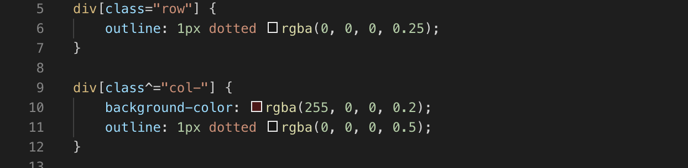
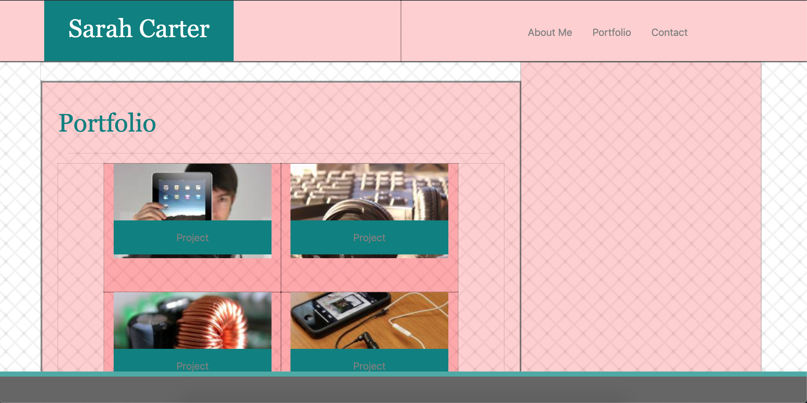

<h1> Portfolio </h1>

The purpose of this project is to rebuild my portfolio using Bootstrap's builtin CSS wireframe. Each html page is responsive to screen size and will look good on a variety of media.

I've included a navigation bar edited from Bootstrap that navigates user between my About Me page, my Contact page, or my Portfolio page.

Each html page is built in a Bootstrap container. The image below outlines the rows and columns in each container, and the code used to show them.

