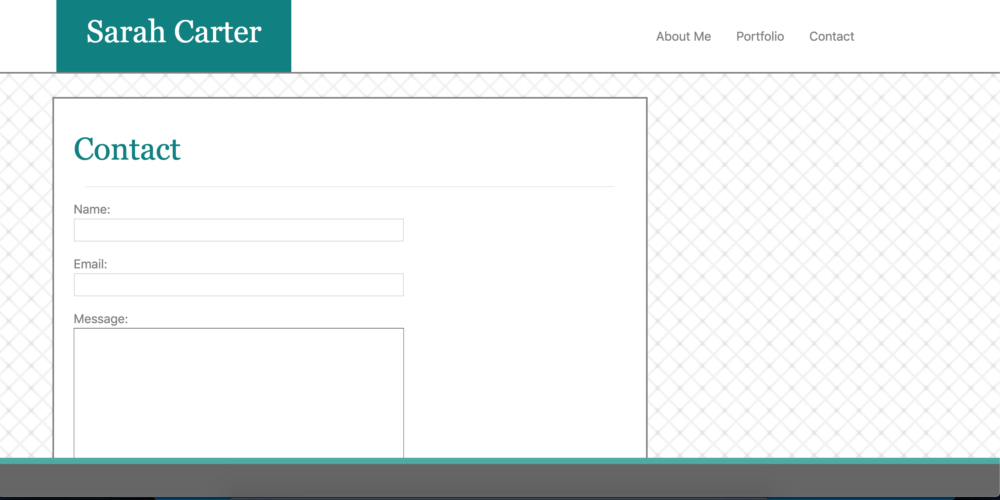
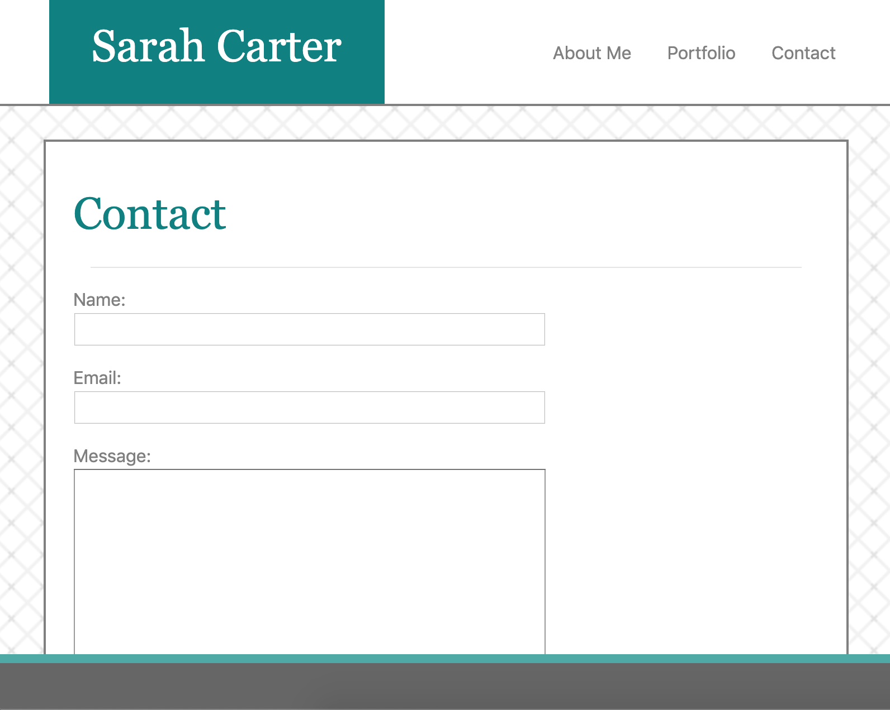
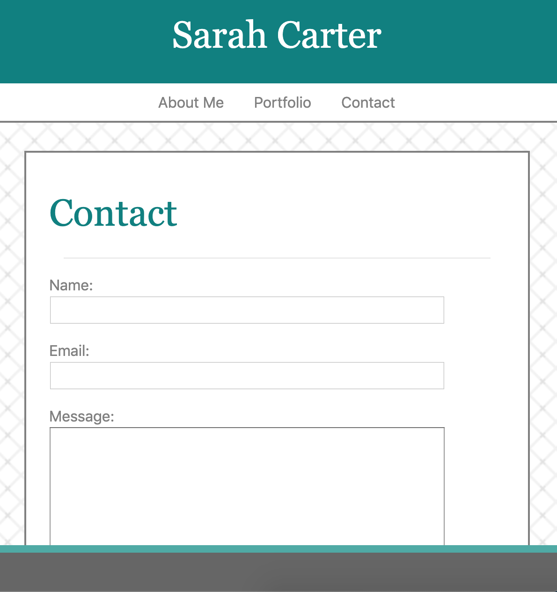
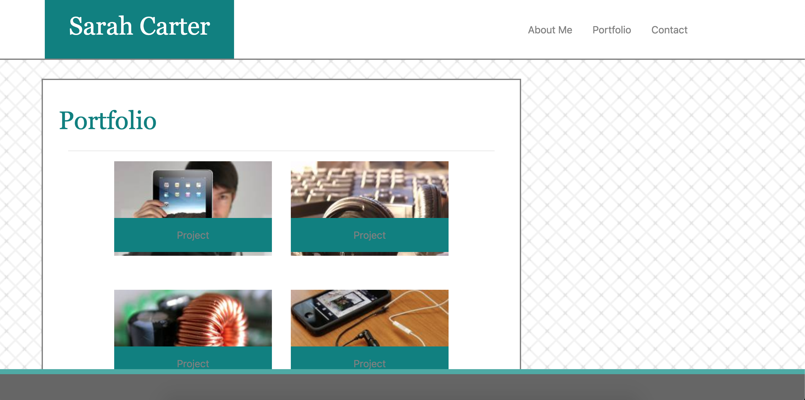
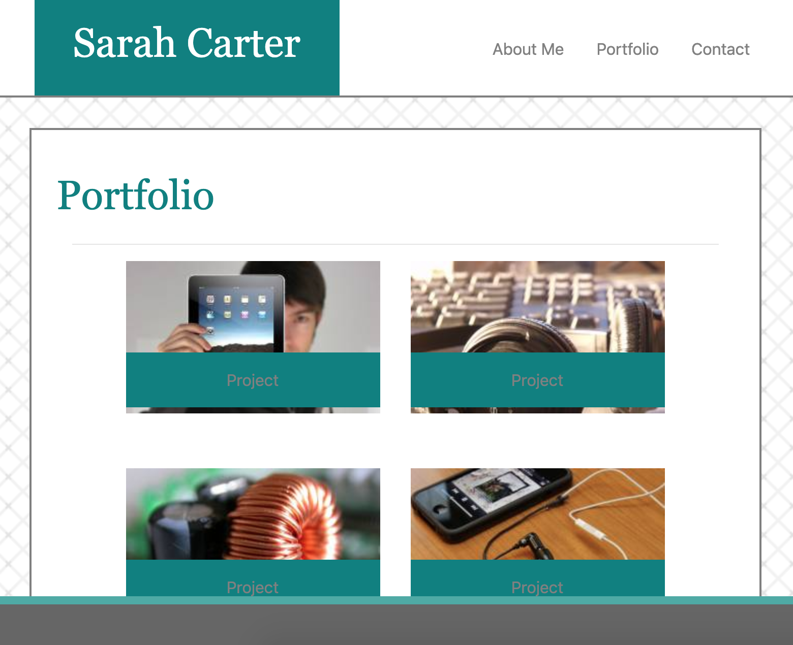
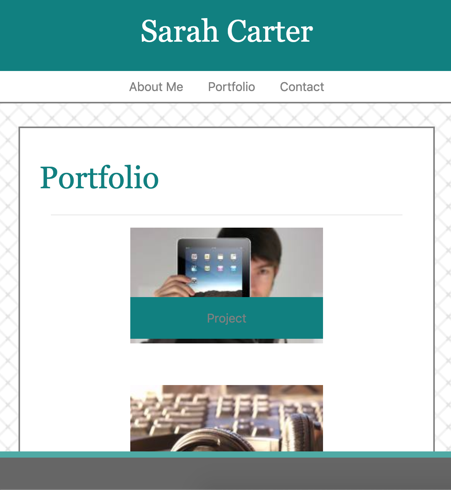

<h1> Portfolio </h1>

The purpose of this project is to rebuild my portfolio using Bootstrap's builtin CSS wireframe. Each html page is responsive to screen size and will look good on a variety of media.

I've included a navigation bar edited from Bootstrap that navigates user between my About Me page, my Contact page, or my Portfolio page.

Each html page is built in a Bootstrap container. The image below outlines the rows and columns in each container, and the code used to show them.

The header is in one row, divided into two columns on medium and large screens. Each column occupies all 12 columns on small screens so that the navbar is below my name and both take up the entire width of the screen.

The body is in a second row below the header row. The main content of the body is in a column that occupies 8 columns on large screens and all 12 columns on medium and small screens.

I designed a container within the main content in portfolio.html that displays a grid of links to hypothetical portfolio projects. This grid collapses on small screens and each project link occupies the entire width of the container.

Below I have included screenshots of what each html page is intended to look like on different screen sizes.

<h1>index.html</h1>

<h1>contact.html</h1>

<h1>portfolio.html</h1>

